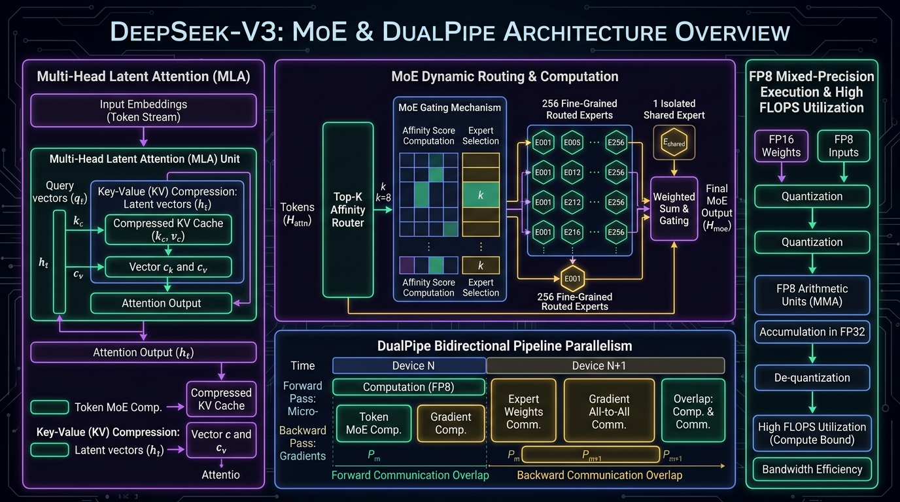

# DeepSeek-V3 DualPipe & 256-Expert MoE Router Studio

[](LICENSE)
[](.github/workflows/sre-validation.yml)
[](https://www.python.org/)
[](https://deepseek.ai)
[](https://talaripradeep.info/tools/deepseek-v3-moe/)

State-of-the-art **DeepSeek-V3 Mixture-of-Experts (MoE)** routing and pipeline parallel scheduler. Simulates **Multi-Head Latent Attention (MLA)** for 14x KV cache compression, dynamic **Top-8 of 256** fine-grained expert routing + 1 shared expert, and **DualPipe** bidirectional overlapping forward/backward pipeline schedules.

---

## 🏛️ Architecture Flow Diagram



---

## 🎬 3Blue1Brown / Manim Programmatic Video Generator

This repository includes a production-grade **Manim** (`manim_flow.py`) animation script rendering token-to-expert routing and DualPipe microbatch schedules.

```bash
# 1. Install animation manifest
pip install -r requirements-animation.txt

# 2. Render fast preview
manim -pql manim_flow.py DeepSeekV3MoEScene

# 3. Render Ultra HD 4K 60fps
manim -pqk manim_flow.py DeepSeekV3MoEScene
```

---

## 🚀 Quickstart & Validation

```bash
git clone https://github.com/Pradeeptalari14/tp-deepseek-v3-moe-router.git
cd tp-deepseek-v3-moe-router

# Install core runtime dependencies
pip install -r requirements.txt

# Run SRE validation suite
bash scripts/validate.sh
```

---

## 📂 Repository Layout

```text
├── .github/workflows/
│   └── sre-validation.yml
├── docs/
│   └── deepseek_v3_moe_flow.png
├── scripts/
│   └── validate.sh
├── moe_router.py              # Top-K Affinity gating & MLA simulation
├── dualpipe_scheduler.py      # Bidirectional pipeline overlap scheduler
├── k8s-deepseek-v3.yaml       # Multi-GPU Kubernetes manifest
├── docker-compose.yml
├── requirements.txt           # Core HTTP runtime dependencies for fast CI
├── requirements-gpu.txt       # Full PyTorch/Triton CUDA dependencies
├── requirements-animation.txt # Manim 4K animation dependencies
├── manim_flow.py              # 3Blue1Brown/Manim programmatic 4K video animation
├── package.json
├── LICENSE
├── SECURITY.md
└── README.md
```
